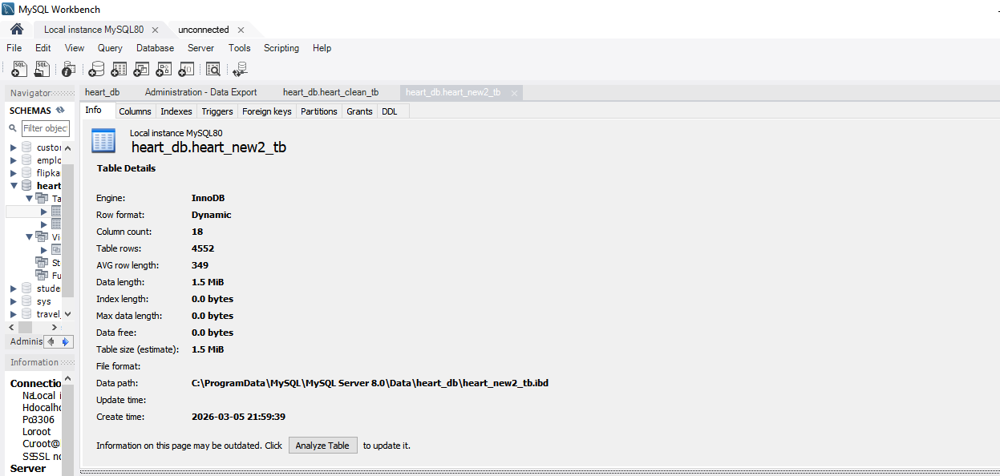
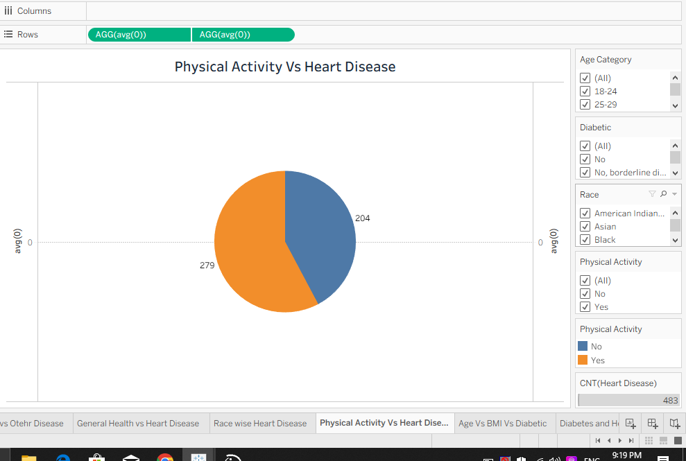
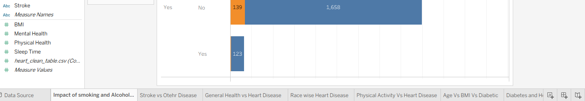

## Performance Testing
Amount of Data in Database

The dataset stored in the database was reviewed using MySQL Workbench. The table information was inspected to determine the number of rows and columns to ensure the dataset size is manageable for analysis and visualization.

# Utilization of Data Filters

Data filters were applied in Tableau to allow users to focus on specific segments of the dataset. Filters such as Age Category, Gender, Smoking status, and Race were used to improve dashboard performance and enable interactive analysis.

# Number of Calculated Fields
No calculated fields were created in this project. All visualizations were developed using the existing dataset attributes.

# Number of Visualizations
A total of 10 visualizations were created in Tableau to analyze relationships between lifestyle factors, demographic attributes, and heart disease.

